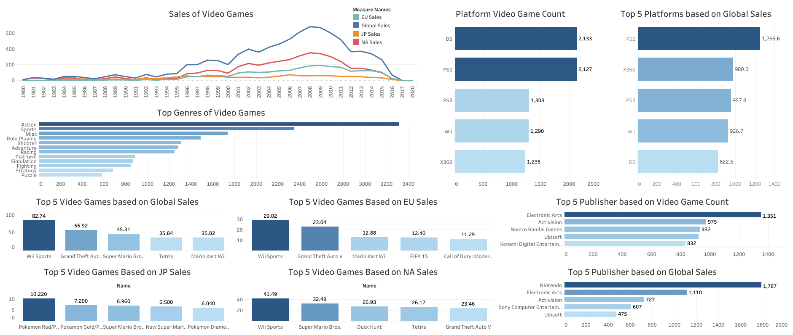

# Video Game Analysis

Video Game Sales Analysis in Python

The goal of the project was to analyze the video games sales dataset and answer business questions likely to come from stakeholders.

## Steps Included:
* Data Processing
* Data Cleaning
* Data Transformation
* Data Analysis
  * Data Visualization

## Packages Used:
* Pandas 
* NumPy
* Matplotlib
* Seaborn

## Columns/Features
* Rank - Rank on Top Video Games Sold
* Name - Name of Video Game
* Platform - Platform Video Game played on
* Year - Year of Release
* Genre - Type of Video Game
* Publisher - Who Created the Video Game
* NA_Sales - North America Sales
* EU_Sales - European Sales
* JP_Sales - Japan Sales
* Other_Sales - Other Countries Sale
* Global_Sales - Total Global Sales
